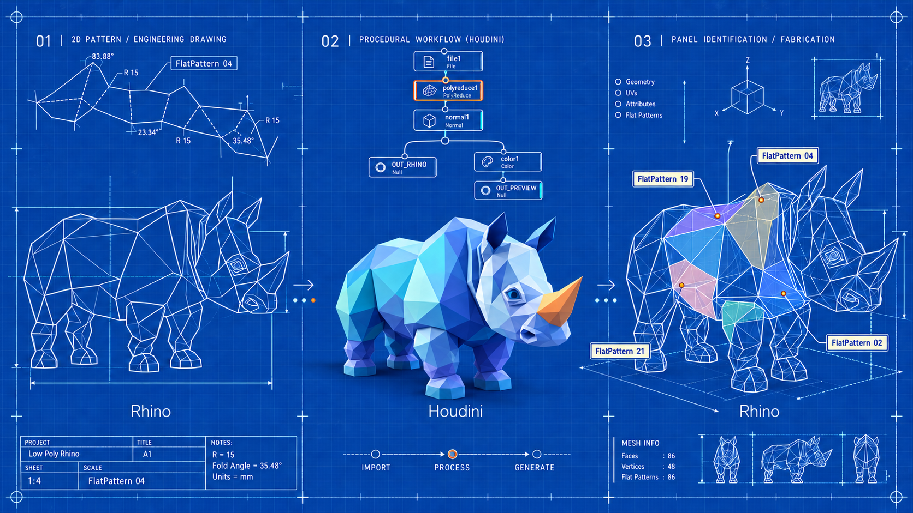

# H3DM — импорт и экспорт Rhino .3dm для Houdini

H3DM добавляет в SideFX Houdini импорт и экспорт файлов Rhino `.3dm` — две SOP-ноды. Работает через
[rhino3dm](https://github.com/mcneel/rhino3dm) (openNURBS, MIT), для чтения файлов Rhino не нужен; необязательная
*подготовка в Rhino* использует запущенный Rhino 8 для файлов без сеток отображения и для точных обрезанных NURBS.

> **Состояние: 0.4.0-dev.7 — импорт работает; экспорт пишет сетки, кривые, NURBS-поверхности, блоки, точки и все атрибуты в исходные координаты; неизменённые Brep возвращаются точно из исходного файла, изменённые обрезанные Brep точно пересобираются в запущенном Rhino 8 (без Rhino — сетками). Выпуск 0.4 — после полной проверки цикла.** Готовы режимы геометрии (сетки, NURBS, обрезанные
> NURBS), атрибуты, кириллица, выход *Info*, глобальный трансформ для моделей далеко от нуля,
> Prepare in Rhino и дисковый кэш.

## Что переносится

| Houdini | Rhino |
|---|---|
| primitive `s@layer` | слой, включая иерархию (`Родитель::Потомок`) |
| primitive `s@LL0`, `s@LL1`, … | уровни слоя (`SC::STSZ::truby` → `SC`, `STSZ`, `truby`), только импорт |
| primitive `s@name` | имя объекта |
| primitive `v@Cd` | цвет объекта |
| группы примитивов | группы объектов |
| `d@user_text`, `id`, `thickness`, `category` и другие | **User Text** — свойства «ключ → значение» |
| `s@material` | материал Rhino по таблице соответствий |
| точки выхода *Info* | текстовые метки, тексты, размеры, выноски, именованные точки, свет, вставки блоков |

* **Режимы геометрии:** *Mesh + NURBS Curves* (по умолчанию) — поверхности и тела сетками отображения Rhino,
  кривые точными NURBS; *NURBS Surfaces + Mesh Solids*; *All NURBS* — кривые, поверхности, обрезанные грани обрезанными
  NURBS, SubD — NURBS. Нерациональные кривые обрезки точные; рациональные (дуги) — ломаные в пределах
  *Trim Curve Tolerance*, отклонение меряется на поверхности в единицах модели (веса обрезки Houdini не учитывает). *Pack per Object* работает с любым режимом. Каждый примитив входит в одну группу
  типа (`h3dm_type_polygon`, `h3dm_type_nurbs_curve`, `h3dm_type_nurbs_surface`, `h3dm_type_packed_geometry`,
  `h3dm_type_other`).
* **NURBS:** грани Brep — NURBS-поверхности Houdini с точными степенью, узлами и весами (узловые векторы с
  интервалами, которые Houdini не принимает, линейно перепараметризуются — форма не меняется).
* **Экспорт обратно в Rhino:** объекты, которые в Houdini не меняли, копируются из исходного файла точно;
  перенесённые, повёрнутые или масштабированные целиком — исходный Brep с точным преобразованием; изменённые
  обрезанные Brep пересобираются в запущенном Rhino 8 (отверстия, объединённые грани, тела; предупреждение, если
  тело разомкнулось) — без Rhino точные обрезанные плоскости и сетки с предупреждением. Необрезанные поверхности,
  кривые, сетки, блоки, точки и все атрибуты пишутся напрямую.
* **Файлы без сеток, точная обрезка, SubD:** rhino3dm не умеет строить сетки и не отдаёт кривые обрезки. Кнопка
  **Prepare in Rhino** отправляет файл в запущенный Rhino 8: он строит сетки всех граней, сохраняет 2D-кривые
  обрезки, переводит SubD в NURBS и пишет `<имя>_h3dm_v###.3dm` рядом с исходником; нода переключается на копию.
  Без подготовки обрезанные грани без сетки пропускаются, а All NURBS даёт необрезанные поверхности + кривые
  границ — с предупреждением.
* **Далеко от нуля:** сдвиг к началу координат считается в double до записи позиций во float32; у импорта есть
  выход *Xform*, у экспорта — вход *Xform*, который возвращает исходные координаты.
* **Кириллица:** имена слоёв, объектов, групп и материалов можно транслитерировать; оригиналы сохраняются и
  возвращаются при экспорте.

## Версии ассетов

У типов нод есть версия: `h3dm::3dm_import::4.0`, `h3dm::3dm_export::4.0`. Houdini держит все установленные версии
рядом; Tab создаёт самую новую, а ноды в сцене остаются на своей версии
([SideFX: версии ассетов](https://www.sidefx.com/docs/houdini/assets/versioning_systems.html)).

* **Нумерация:** релиз `0.N` -> ассеты `::N.0` (0.4 -> `::4.0`); исправление выпущенной версии, меняющее её
  поведение, -> `::N.1`; после 1.0 релиз `M.N` -> `::(10*M+N).0`. Релиз 0.4 начинается с `::4.0`.
* **Замороженные версии:** выпущенная версия ассетов не меняется никогда. Её Python-код — замороженная копия
  (`python3.13libs/h3dm_4_0/`, со своими скриптами Rhino), а её HDA (`otls/h3dm_3dm_import_4.0.hda`) вызывают только
  эту копию — сцены, сделанные с ней, считаются одинаково при любой следующей версии H3DM. Проверяют это
  `FROZEN.sha256` и `tests/test_frozen.py`.
* `::1.0` — все ноды, созданные до введения версий (H3DM 0.3.x – 0.4.0-dev.6), заморожены кодом 0.4.0-dev.6.
* Перевести ноду на новую версию: создать новую ноду и перенести параметры; Houdini сам ноду не обновляет.
  Замороженные версии используют общий `vendor/rhino3dm`; с какими версиями rhino3dm и Houdini проверена каждая
  версия ассетов — в `VERSIONS.json`.

## Установка

1. Клонировать репозиторий (`git clone https://github.com/evgeni17/H3DM.git`).
2. Скопировать `H3DM.json` в папку packages Houdini и указать в `"H3DM"` путь к папке плагина;
   `"H3DM_HELP_LANG"` — `en` или `ru`.
3. Запустить Houdini, выполнить **H3DM › Install / Update rhino3dm** — ставится ровно та версия rhino3dm, с которой
   проверена эта версия H3DM (ассеты 4.0 / H3DM 0.4: **rhino3dm 8.35.0**, Houdini 22.0.429; таблица по всем версиям —
   [`VERSIONS.json`](VERSIONS.json)). Если установлена другая, ноды предупреждают. В одной сессии Houdini загружается
   одна rhino3dm для всех версий ассетов — ставьте указанную для самой новой версии, с которой работаете.
4. Один раз выполнить **H3DM › Rebuild HDAs**.

Для *Prepare in Rhino* нужен запущенный на том же компьютере Rhino 8 (Mac или Windows). Если кнопка его не видит,
выполните в Rhino команду `StartScriptServer`. Скрипт `rhino/h3dm_prepare.py` можно запустить и вручную в
Script Editor Rhino — он готовит активный документ.

## Дисковый кэш

Нода импорта сохраняет готовые выходы как `.bgeo.sc` в `$HOUDINI_TEMP_DIR/h3dm_cache` (вкладка Cache: папка,
лимит размера, *Clear Disk Cache*). Ключ учитывает файл, все параметры, вход Xform и версии — любое изменение
готовит заново. На тестовой модели 225 МБ готовка из кэша — 1–2 с вместо 4–9 с.

## Лицензия

Copyright 2026 EOK. Apache License 2.0 ([LICENSE](LICENSE)); сторонние компоненты — [THIRD_PARTY_NOTICES.md](THIRD_PARTY_NOTICES.md).
